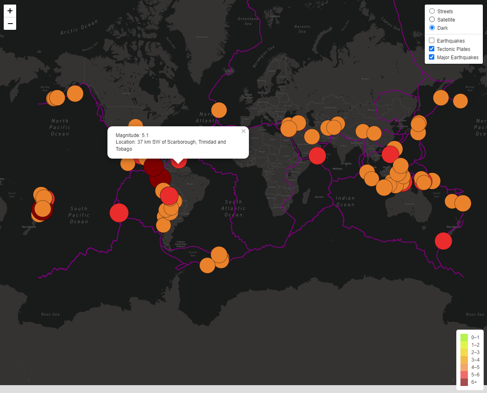
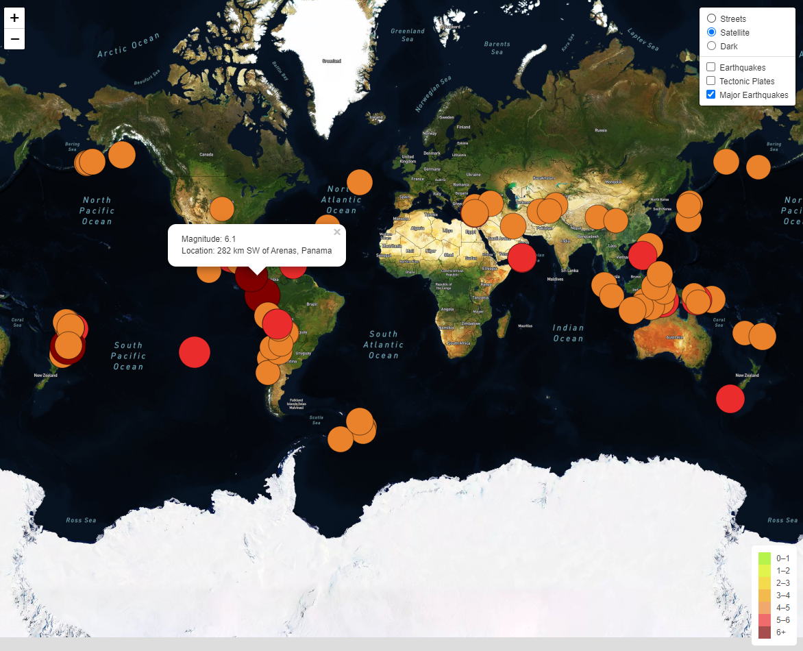
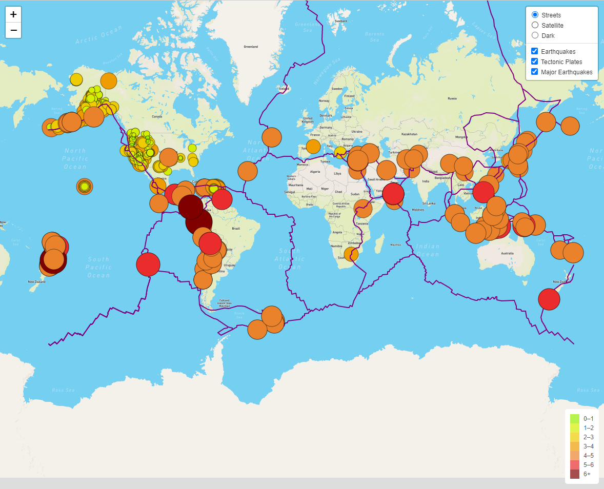

# Mapping_Earthquakes

## Overview of the project

The purpose of this project is to visually show the differences between the magnitudes of earthquakes all over the world for the last seven days.

## Results

To build the web page the latest earthquake geoJSON data from the US geological survey website is used. The earthquake data is traversed and retrieved using JavaScript, the D3 and leaflet libraries and is plotted on the mapbox map through an API request. 

On the map the magnitude and location of each earthquake is shown in a popup marker. 

The diameter of the markers for each earthquake reflects the magnitude of the earthquake in their size and color. Earthquakes with higher magnitudes appear larger and darker in color with a legend providing the context for the map data.

To illustrate the relationship between the location and frequency of seismic activity tectonic plates boundaries are added to the map.

## Summary

The interactive web page is able to show all the earthquakes for the last week, only major ones and tectonic plates boundaries with three map option and a legend providing the context for the map data. The popup marker contains information about magnitude and location of each earthquake.

